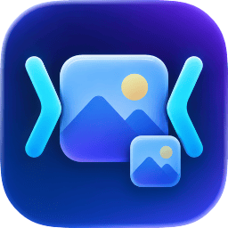
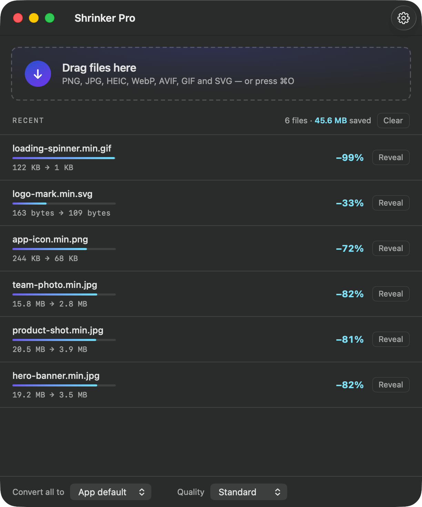
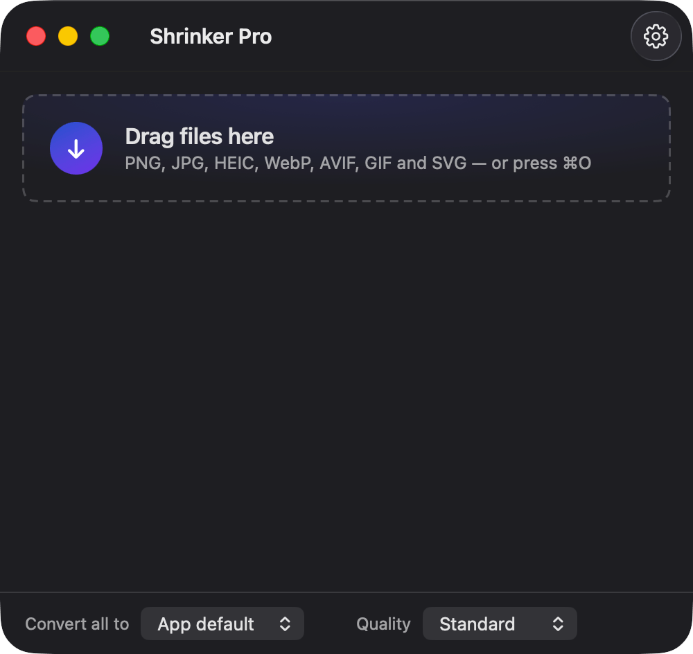
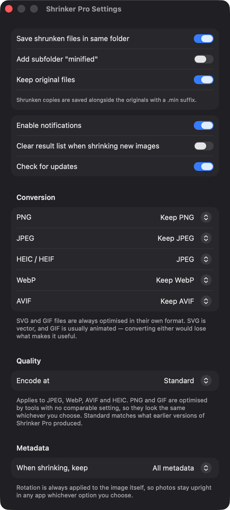

<div align="center">



# Shrinker Pro

**Minify images and graphics with one drop.**
A native Apple Silicon (ARM) macOS app — M1 through M5, no Rosetta.

[](https://github.com/jeso87/ShrinkerPro/releases/latest/download/ShrinkerPro.dmg)
[](https://shrinkerpro.app)
[](LICENSE)

[shrinkerpro.app](https://shrinkerpro.app)

<!-- GitHub honours prefers-color-scheme in <picture>, so the screenshots
     follow the reader's theme instead of glaring at half of them. -->
<picture>
  <source media="(prefers-color-scheme: dark)" srcset="docs/screenshots/main-window-dark.png">
  <source media="(prefers-color-scheme: light)" srcset="docs/screenshots/main-window-light.png">
  
</picture>

</div>

Drag PNG, JPEG, GIF, SVG, WebP, AVIF, or HEIC files onto the window and
Shrinker Pro writes a smaller copy beside the original — or wherever you tell
it to. Originals are never replaced unless you ask for that — "Keep original
files" is on by default, and turning it off is what writes over them.

Photos keep their rotation. EXIF orientation is applied to the pixels rather
than passed along as a tag, so a portrait iPhone shot comes out upright in
every app, whatever format you convert it to.

Everything happens on your Mac. The compressors are bundled inside the app,
and the only network request it makes is the update check, which you can
turn off in Settings.

## Install

**[Download Shrinker Pro](https://github.com/jeso87/ShrinkerPro/releases/latest/download/ShrinkerPro.dmg)** — or browse [all releases](https://github.com/jeso87/ShrinkerPro/releases/latest). What changed in each version is in [CHANGELOG.md](CHANGELOG.md).

Open the DMG and drag Shrinker Pro to Applications. The app is signed with a
Developer ID and notarized by Apple, with the notarization ticket stapled to
the DMG, so it opens by double-clicking — no right-click-Open, no Gatekeeper
warning, and no network round trip on first launch.

Requires macOS 14 Sonoma or later on Apple Silicon. There is no Intel build,
by design — see below.

Updates are handled in-app by [Sparkle](https://sparkle-project.org/):
Shrinker Pro checks once a day and on "Check for Updates…" in the app menu,
and every update's signature is verified before it is installed. You can turn
the automatic check off in Settings.

## Why this exists

Shrinker Pro is a native rewrite of [Image Shrinker](https://github.com/stefansl/image-shrinker)
by Stefan Schulz-Lauterbach. The original is an Electron app, and its latest
release — 1.6.4, from October 2020 — ships its compression binaries as x64-only
builds, so on an ARM Mac they run through Rosetta 2 and fail outright without
it. That is why Image Shrinker asks to install Rosetta on a Mac that doesn't
have it. Apple ended Intel Mac support with macOS 26 Tahoe,
and Rosetta 2 is on a published sunset path — full availability through macOS 26
and 27, then narrowing to a limited subset for older game frameworks. Anything
leaning on translation has a deadline attached to it.

Shrinker Pro replaces the Electron shell with SwiftUI and rebuilds the same
compressors as static arm64 binaries. Every Mach-O in the bundle is arm64-only,
verified by a release gate (`scripts/verify-arch.sh`) that blocks notarization
if anything else appears.

## Compression

Each format is optimised in place by its own encoder:

| Format | Tool |
|---|---|
| JPEG | [mozjpeg](https://github.com/mozilla/mozjpeg) 4.1.5 (`cjpeg`) |
| PNG | [pngquant](https://pngquant.org/) 3.0.3 |
| GIF | [gifsicle](https://github.com/kohler/gifsicle) 1.96 |
| SVG | [svgo](https://github.com/svg/svgo) 4.1.0, run in JavaScriptCore |
| WebP | [libwebp](https://developers.google.com/speed/webp) 1.6.0 (`cwebp`) |
| AVIF | ImageIO (macOS system framework) |

cjpeg, pngquant, gifsicle, and cwebp are built from source as static arm64
binaries and shipped in `Contents/Helpers/`. svgo runs entirely inside a
`JSContext` — no Node.js, no bundled interpreter binary. AVIF and HEIC are
handled by ImageIO, which encodes and decodes both natively on macOS; nothing
is vendored for them.

HEIC has no in-place optimiser here — it is always converted (see below).

Most of the saving is lossy. pngquant reduces a PNG to an optimised palette of
at most 256 colours, and cjpeg re-encodes a JPEG at its default quality of 75;
WebP and AVIF conversions encode at 80 (see below). gifsicle's `-O2`
optimisation is lossless. "Keep original files" is on by default, so the
original is still there to compare against.

## Conversion

Settings carries one conversion rule per input format, so you can convert a
single format without touching the rest — screenshots to WebP, say, while
JPEGs stay JPEGs.

| Input | Options | Default |
|---|---|---|
| PNG | Keep PNG · JPEG · WebP · AVIF | Keep PNG |
| JPEG | Keep JPEG · JPEG · WebP · AVIF | Keep JPEG |
| HEIC / HEIF | JPEG · WebP · AVIF | JPEG |
| WebP | Keep WebP · JPEG · WebP · AVIF | Keep WebP |
| AVIF | Keep AVIF · JPEG · WebP · AVIF | Keep AVIF |

HEIC/HEIF has no "keep" option. It is a camera capture format that most tools
outside Apple's ecosystem still can't open, so leaving it as-is is rarely what
anyone wants — JPEG is the default, and WebP or AVIF are there if you'd rather
have a modern format.

**SVG and GIF have no rule and never convert.** SVG is vector, and GIF is
usually animated; converting either would destroy what makes it useful. This
is stated in the Settings panel too, so their absence doesn't read as an
oversight.

Conversions encode at quality 80 (`cwebp -q 80`, or `0.80` for ImageIO's
lossy targets). Where an encoder can't read the source format directly — cjpeg
reads neither PNG, WebP, AVIF nor HEIC — the pixels are relayed through a
lossless intermediate rather than a second lossy hop. `ConversionRouter`
decides the route for every input × rule combination, and is a pure function
with no file or process access, so all of it is enumerable in tests.

Converting to a format's own type (JPEG→JPEG, WebP→WebP, AVIF→AVIF) takes the
same fast path as "keep" — it compresses, it does not round-trip.

### Convert all to…

Above the results list is a session override: **Convert all to** JPEG, WebP,
AVIF or PNG. It replaces every per-format rule at once for as long as the app
is open, without touching what you have stored, and it is gone the next time
you launch. It is in the window rather than in Settings deliberately — it is
visible the whole time it is on, so nothing converts behind your back.

PNG is available here and nowhere else. As a stored rule it would sit next to
"Keep PNG" meaning almost the same thing; as a one-off it is genuinely useful,
for flattening a mixed folder to a single lossless format. PNG is lossless, so
photographs converted to it usually get *larger* — the app says so when you
pick it, and the results row reports the negative saving honestly.

SVG and GIF ignore the override, exactly as they ignore the stored rules.

## Metadata

Settings carries one choice: keep **all metadata**, **copyright and credit
only**, or **none**. The default is all — JPEG→JPEG already preserved EXIF
before this setting existed, so anything else would have quietly deleted
capture data from files the app used to round-trip intact.

"Copyright and credit only" is the one to reach for before posting a photo
anywhere: it keeps the rights and attribution fields and drops GPS, capture
time and camera details.

Rotation is not covered by any of the three. It is always applied to the
pixels and never written back as a tag, because an orientation tag is an
instruction about how to draw an image rather than a fact about it — and by
the time the file is written, that instruction has been carried out.

Metadata is rewritten without re-encoding: `CGImageDestinationCopyImageSource`
copies the compressed image data across verbatim, so pngquant's palette and
mozjpeg's progressive scans survive a metadata change intact.

## What it does — and doesn't do

- Drop files or a folder anywhere on the window, or use "Open Files…". The
  entire window is a drop target, not just the dashed zone. A dropped folder
  includes its subfolders; hidden folders and packages (apps, photo
  libraries) are skipped, so a drop never rewrites the inside of either.
- Image files also open from Finder's "Open With" menu, or by dropping them
  on the Dock icon.
- Output goes beside the original by default, or to a folder you choose. "Keep
  original files" writes a `.min` copy alongside; turn it off and the original
  is replaced in place. A `minified/` subfolder is optional either way.
- Results accumulate for the session, showing each file's before/after size
  and percentage saved. "Clear" empties the list; a Settings toggle can clear
  it automatically on each new drop instead.
- Click a result row to reveal the file in Finder. Hover for the full path.
- Optional notification when a batch finishes. If notifications are turned off
  for the app in System Settings, the panel says so rather than failing quietly.
- Settings persist across launches (backed by `UserDefaults`).
- Updates via [Sparkle](https://sparkle-project.org/) 2.9.6: "Check for
  Updates…" in the app menu, plus an automatic background check gated by
  the same "Check for updates" toggle in Settings. Sparkle polls
  `appcast.xml` (published by `scripts/release.sh`, served from this repo's
  GitHub Pages) and verifies every update's EdDSA signature before offering
  to install it.

## Screenshots

<table>
<tr>
<td width="50%" valign="top">

<picture>
  <source media="(prefers-color-scheme: dark)" srcset="docs/screenshots/empty-state-compact-dark.png">
  <source media="(prefers-color-scheme: light)" srcset="docs/screenshots/empty-state-compact-light.png">
  
</picture>

Drop anywhere in the window, not just the dashed zone.

</td>
<td width="50%" valign="top">

<picture>
  <source media="(prefers-color-scheme: dark)" srcset="docs/screenshots/settings-dark.png">
  <source media="(prefers-color-scheme: light)" srcset="docs/screenshots/settings-light.png">
  
</picture>

Output location, notifications, per-format conversion rules and metadata.

</td>
</tr>
</table>

## Requirements

macOS 14 Sonoma or later on Apple Silicon — any M1, M2, M3, M4 or M5 Mac.
Rosetta 2 is not needed, and there is no Intel build.

## Build

```shell
./scripts/bootstrap.sh          # Xcode path, xcodegen, cmake, autoconf/automake, Node, Rust
./scripts/build-compressors.sh  # static arm64 cjpeg, pngquant, gifsicle, cwebp
./scripts/prepare-svgo.sh       # svgo bundle, ESM export stripped for JSContext
./scripts/prepare-sparkle.sh    # Sparkle.framework, fetched and thinned to arm64
./scripts/make-icon.sh          # app icon
xcodegen generate
xcodebuild -scheme ShrinkerPro build
```

`build-compressors.sh` also builds libpng 1.6.58 and libwebp 1.6.0 from source,
because cwebp needs PNG and JPEG *input* decoding and Homebrew's libraries are
dynamic. It reuses mozjpeg's static libjpeg for the JPEG side. Every library is
linked into the helper binaries; no dylibs are shipped.

`bootstrap.sh` exports `DEVELOPER_DIR` for the invocation rather than running
`xcode-select -s` — it doesn't require `sudo` and doesn't touch the
system-wide Xcode path. It also installs Node if `npm` isn't already on
`PATH`: `prepare-svgo.sh` fetches the svgo bundle with `npm pack`. That is
the only thing Node is used for — no Node runtime is bundled, and svgo runs
inside JavaScriptCore in the shipped app.

Building from source needs Xcode 15+ and Homebrew.

`./scripts/verify-arch.sh <path-to-.app>` audits a built bundle: every Mach-O
must be arm64-only, target macOS 14.0 or lower, and link nothing outside
`/usr/lib` and `/System/Library`. It fails closed — a missing target or zero
files examined is an error, not a pass.

Release a signed, notarized DMG with `./scripts/release.sh`.

## Credits

- [Image Shrinker](https://github.com/stefansl/image-shrinker) by Stefan
  Schulz-Lauterbach, released under CC0-1.0 — the original this is based on.
  CC0 requires no attribution; it's given anyway.
- [mozjpeg](https://github.com/mozilla/mozjpeg), [pngquant](https://pngquant.org/),
  [gifsicle](https://github.com/kohler/gifsicle), [libwebp](https://developers.google.com/speed/webp),
  and [svgo](https://github.com/svg/svgo), which do the actual compression.
