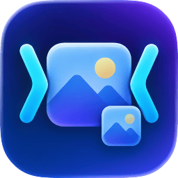
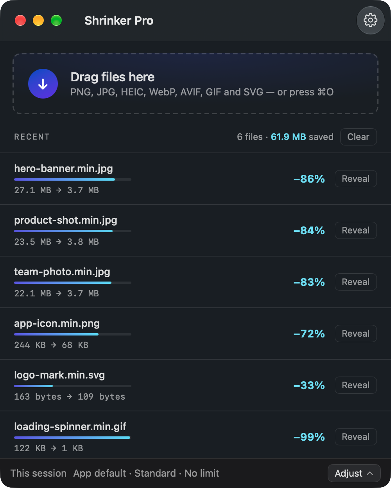
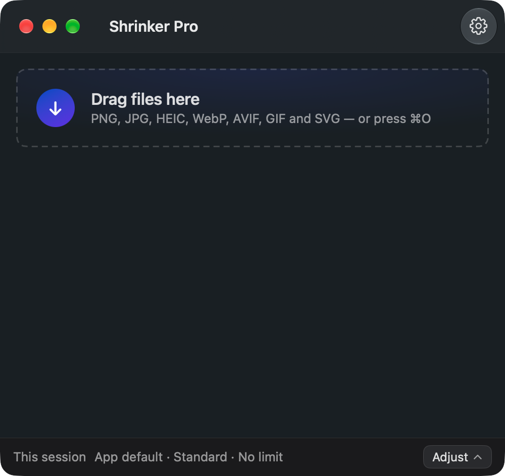
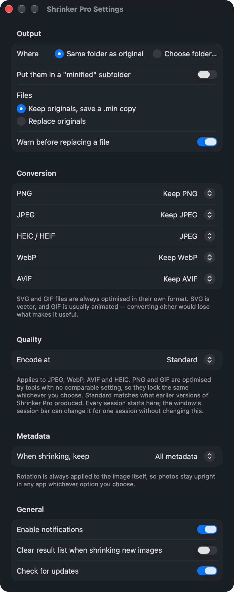
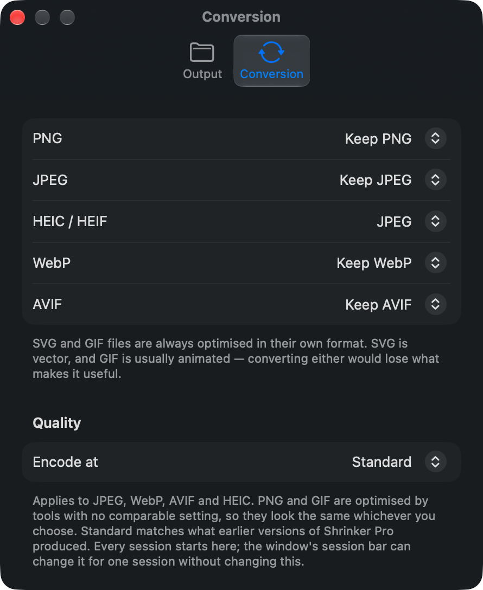
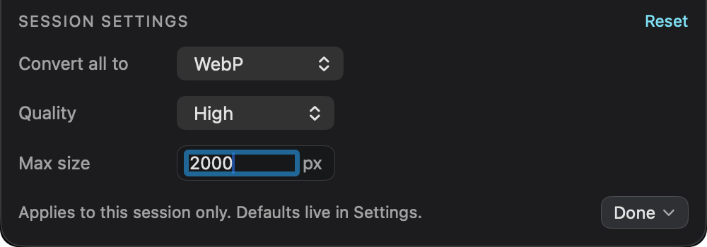

<div align="center">



# Shrinker Pro

**Minify images and graphics with one drop.**
A native Apple Silicon (ARM) macOS app — M1 through M6, no Rosetta.

[](https://github.com/jeso87/ShrinkerPro/releases/latest/download/ShrinkerPro.dmg)
[](https://shrinkerpro.app)
[](LICENSE)

[shrinkerpro.app](https://shrinkerpro.app)

<!-- GitHub honours prefers-color-scheme in <picture>, so the screenshots
     follow the reader's theme instead of glaring at half of them. -->
<picture>
  <source media="(prefers-color-scheme: dark)" srcset="docs/screenshots/main-window-dark.png">
  <source media="(prefers-color-scheme: light)" srcset="docs/screenshots/main-window-light.png">
  
</picture>

</div>

Drag PNG, JPEG, GIF, SVG, WebP, AVIF, or HEIC files onto the window and
Shrinker Pro writes a smaller copy beside the original — or wherever you tell
it to. Originals are never replaced unless you ask for that — "Keep original
files" is on by default, and turning it off is what writes over them.

Photos keep their rotation. EXIF orientation is applied to the pixels rather
than passed along as a tag, so a portrait iPhone shot comes out upright in
every app, whatever format you convert it to.

Everything happens on your Mac. The compressors are bundled inside the app,
and the only network request it makes is the daily update check — which is
deliberately not optional, and is described in full further down.

## Languages

Shrinker Pro is translated into 36 languages: Arabic, Catalan, Chinese
(Simplified, Traditional and Hong Kong), Croatian, Czech, Danish, Dutch,
English, Finnish, French, German, Greek, Hebrew, Hungarian, Icelandic,
Italian, Japanese, Korean, Norwegian (Bokmål and Nynorsk), Persian, Polish,
Portuguese (Brazil and Portugal), Romanian, Russian, Slovak, Slovenian,
Spanish, Swedish, Thai, Turkish, Ukrainian and Vietnamese.

There is nothing to choose — it follows the language macOS is set to. The set
matches the 36 [Sparkle](https://sparkle-project.org/) ships, so the app and
its update dialog can never be in different languages, and the update notes
are translated too. Arabic, Hebrew and Persian lay the window out right to
left.

Where macOS already has a word for something, the app uses that word rather
than a fresh translation of it: **Reveal in Finder**, **Keep Both**,
**Replace** and the rest were each read out of the system's own shipping
resources. Plural categories were measured from the platform per language
rather than taken from a table — Arabic reaches five for whole numbers,
Slovenian four, Polish and Russian never reach `other` at all — and so was
typography, which is why Czech, Slovak, Polish and Russian carry non-breaking
spaces after one-letter prepositions and Croatian, Slovenian and Ukrainian do
not.

**These are machine translations checked against the platform's own
terminology, not native-speaker work.** No speaker of every language has
reviewed them. Corrections are welcome and are a one-file change:
`translations/<lang>.json`, one per language, merged into the string catalog
by `scripts/merge-translations.py`. `docs/localization-glossary.md` records
the terms that have to stay consistent and why.

The headless `shrinker` command stays in English on purpose. Its output is
something scripts parse, and a message that changes wording with the Mac's
region is a message no script can match on.

## Install

**[Download Shrinker Pro](https://github.com/jeso87/ShrinkerPro/releases/latest/download/ShrinkerPro.dmg)** — or browse [all releases](https://github.com/jeso87/ShrinkerPro/releases/latest). What changed in each version is in [CHANGELOG.md](CHANGELOG.md).

Open the DMG and drag Shrinker Pro to Applications. The app is signed with a
Developer ID and notarized by Apple, with the notarization ticket stapled to
the DMG, so it opens by double-clicking — no right-click-Open, no Gatekeeper
warning, and no network round trip on first launch.

Requires macOS 14 Sonoma or later on Apple Silicon. There is no Intel build,
by design — see below.

Updates are handled in-app by [Sparkle](https://sparkle-project.org/):
Shrinker Pro checks once a day and on "Check for Updates…" in the app menu,
and every update's signature is verified before it is installed. Checking is
not installing — you are told about a new version and decide whether to take
it.

### The command line

`shrinker` runs the same compression engine without a window — for scripts,
for build steps, and for AI assistants that can run a command but cannot drag
a file onto a drop zone.

```sh
brew install jeso87/tap/shrinker
```

```sh
shrinker photo.jpg                              # a .min copy beside it
shrinker --quality super-low --to webp ./shots   # a whole folder
shrinker --json --quality 85 diagram.jpg         # one JSON line per file
shrinker --max-size 2000 ./camera-roll           # nothing wider or taller than 2000px
shrinker --crop 1:1 ./avatars                    # square, from the center
shrinker --crop 1200x1200 ./product-shots        # square and exactly 1200px
```

| | |
|---|---|
| `--quality <level\|0-100>` | `super-low`, `low`, `standard` (default), `high` — or a number |
| `--to <format>` | `jpeg`, `webp`, `avif`, `png` |
| `--max-size <pixels>` | shrink any image whose longest side is bigger than this |
| `--crop <WxH\|W:H>` | crop the center to this shape. `1200x1200` also scales to that size; `1:1` only changes the shape |
| `--metadata <policy>` | `all` (default), `copyright`, `none` |
| `--out <directory>` | write results here instead of beside each input |
| `--in-place` | overwrite each original. This destroys the source |
| `--if-exists <what>` | when the destination exists: `replace` (default), `skip`, `keep-both`, `fail` |
| `--json` | one machine-readable object per file, on stdout |

It writes a `.min` copy beside each original, and only overwrites the
originals themselves with `--in-place`. Folders are searched the same way dropping one on the window
searches them, packages and hidden directories included — which is to say,
excluded. Exit codes distinguish a usage mistake from a failed shrink, so a
script can tell "you typed it wrong" from "the work failed".

By default a result replaces whatever is already at its destination, which is
what every earlier version did. `--if-exists` changes that per run: `skip`
leaves existing files alone, `keep-both` writes `photo.min 2.jpg` beside them,
and `fail` refuses the run before any work starts.

Two differences from the app. It never reads your saved preferences, so
nothing converts unless `--to` asks — except HEIC, which has no "keep" option
anywhere and always becomes a JPEG. And `--quality` accepts a bare number as
well as a level name, for hitting a size target the four named stops don't
reach.

`shrinker --help` is written to be read by something meeting the tool for the
first time, and lists everything above.

## Why this exists

Shrinker Pro is a native rewrite of [Image Shrinker](https://github.com/stefansl/image-shrinker)
by Stefan Schulz-Lauterbach. The original is an Electron app, and its latest
release — 1.6.4, from October 2020 — ships its compression binaries as x64-only
builds, so on an ARM Mac they run through Rosetta 2 and fail outright without
it. That is why Image Shrinker asks to install Rosetta on a Mac that doesn't
have it. Apple ended Intel Mac support with macOS 26 Tahoe,
and Rosetta 2 is on a published sunset path — full availability through macOS 26
and 27, then narrowing to a limited subset for older game frameworks. Anything
leaning on translation has a deadline attached to it.

Shrinker Pro replaces the Electron shell with SwiftUI and rebuilds the same
compressors as static arm64 binaries. Every Mach-O in the bundle is arm64-only,
verified by a release gate (`scripts/verify-arch.sh`) that blocks notarization
if anything else appears.

## Compression

Each format is optimised in place by its own encoder:

| Format | Tool |
|---|---|
| JPEG | [mozjpeg](https://github.com/mozilla/mozjpeg) 4.1.5 (`cjpeg`) |
| PNG | [pngquant](https://pngquant.org/) 3.0.3 |
| GIF | [gifsicle](https://github.com/kohler/gifsicle) 1.96 |
| SVG | [svgo](https://github.com/svg/svgo) 4.1.0, run in JavaScriptCore |
| WebP | [libwebp](https://developers.google.com/speed/webp) 1.6.0 (`cwebp`) |
| AVIF | ImageIO (macOS system framework) |

cjpeg, pngquant, gifsicle, and cwebp are built from source as static arm64
binaries and shipped in `Contents/Helpers/`. svgo runs entirely inside a
`JSContext` — no Node.js, no bundled interpreter binary. AVIF and HEIC are
handled by ImageIO, which encodes and decodes both natively on macOS; nothing
is vendored for them.

HEIC has no in-place optimiser here — it is always converted (see below).

Most of the saving is lossy. A **Quality** setting — Super Low, Low, Standard
or High — governs the lossy encoders. Standard is the default and produces
what every previous version of the app did: cjpeg at its own default of 75, and
80 for WebP and AVIF.

**Compressing a file never makes it bigger.** Re-encoding an already-compressed
image at a quality above the one it was stored at inflates it, and the original
quality of a file cannot be read back out of it — so rather than guess, the app
checks afterwards: if a same-format result comes out larger than the source, it
is discarded and your file is left alone, reported as 0% saved. Conversions are
exempt, because growth there is what you asked for — see PNG below.

**PNG and GIF sit outside the Quality setting**, deliberately. pngquant reduces
a PNG to an optimised palette of at most 256 colours, and gifsicle's `-O2`
optimisation is lossless; neither tool takes a comparable quality dial, so those
files come out the same whichever level you pick. They are still covered by the
never-grow check above.

"Keep original files" is on by default, so the original is still there to
compare against.

## Conversion

Settings carries one conversion rule per input format, so you can convert a
single format without touching the rest — screenshots to WebP, say, while
JPEGs stay JPEGs.

| Input | Options | Default |
|---|---|---|
| PNG | Keep PNG · JPEG · WebP · AVIF | Keep PNG |
| JPEG | Keep JPEG · JPEG · WebP · AVIF | Keep JPEG |
| HEIC / HEIF | JPEG · WebP · AVIF | JPEG |
| WebP | Keep WebP · JPEG · WebP · AVIF | Keep WebP |
| AVIF | Keep AVIF · JPEG · WebP · AVIF | Keep AVIF |

HEIC/HEIF has no "keep" option. It is a camera capture format that most tools
outside Apple's ecosystem still can't open, so leaving it as-is is rarely what
anyone wants — JPEG is the default, and WebP or AVIF are there if you'd rather
have a modern format.

**SVG and GIF have no rule and never convert.** SVG is vector, and GIF is
usually animated; converting either would destroy what makes it useful. This
is stated in the Settings panel too, so their absence doesn't read as an
oversight.

Conversions encode at the chosen Quality level; at Standard that is `cwebp -q
80`, or `0.80` for ImageIO's lossy targets. Where an encoder can't read the
source format directly — cjpeg reads neither PNG, WebP, AVIF nor HEIC — the
pixels are relayed through a lossless intermediate rather than a second lossy
hop. `ConversionRouter` decides the route for every input × rule combination,
and is a pure function with no file or process access, so all of it is
enumerable in tests.

Converting to a format's own type (JPEG→JPEG, WebP→WebP, AVIF→AVIF) takes the
same fast path as "keep" — it compresses, it does not round-trip.

### The session settings bar

Pinned along the bottom of the window, below the scrolling history, is one line
saying what will happen to the next files you drop:

    This session   WebP · High · Max 2000px   Reset            Adjust ⌃

**Adjust** opens the four controls in place — **Convert all to**, **Quality**,
**Max size** and **Crop to** — and Done, Escape or a click anywhere above closes
them again. Nothing is ever discarded by closing: a value applies the moment it
is chosen. A dot appears beside the summary whenever any of them differs from
what the app would do on its own, and **Reset** puts them all back. On a narrow
window the summary moves to a line of its own beneath the controls rather than
truncating, because a value hidden behind an ellipsis is a value not stated.

**Everything in the bar applies to this session only.** It is typed in the
window, it is never written to disk, and it is gone the next time you launch —
the defaults each session starts from live in Settings. That is why the summary
is always on screen: a setting that changes every file must never be invisible,
which is the same argument that kept the format override out of Settings in the
first place.

**Convert all to** — JPEG, WebP, AVIF or PNG — replaces every per-format rule at
once, without touching what you have stored. "App default" means your stored
rules apply.

PNG is available here and nowhere else. As a stored rule it would sit next to
"Keep PNG" meaning almost the same thing; as a one-off it is genuinely useful,
for flattening a mixed folder to a single lossless format. PNG is lossless, so
photographs converted to it usually get *larger* — a warning appears beside the
control when you pick it, and the results row reports the negative saving
honestly.

**Quality** is the same Super Low / Low / Standard / High scale that lives in
Settings, within reach without opening a panel. Changing it here changes this
session; the stored default is left alone.

**Max size** caps the longest side: a landscape image is scaled by its width and
a portrait one by its height, always keeping the aspect ratio, and anything
already inside the cap is left at the size it arrived. Leave it blank for no
resizing. It is in force the moment it is typed, with no Return to press.

**Crop to** cuts the largest centered rectangle of a given shape out of every
image. Two numbers, and a choice of what they mean: **ratio** — `16 : 9` —
crops to that shape and leaves the resolution alone, and **px** — `1200 × 1200`
— crops to that shape and then scales it down to exactly that size, which is
what you want for a folder of product photos that all have to come out the same.

Nothing is ever enlarged. An 800×600 image asked for 1200×1200 comes out
600×600: the right shape, smaller than asked. The shape is used exactly as
typed, so a portrait photo cropped to 16:9 comes out as a landscape strip rather
than being quietly turned on its side to suit.

Both numbers are needed. With only one filled in nothing can be cropped, so the
panel will not close and files will not be shrunk until you finish the pair or
clear it — the alternative was running a whole batch as though the number had
never been typed, which is not undoable once the originals have been replaced.

A **px** crop sets the output size outright, so the Max size field is dimmed
while one is in force: the two would be answers to the same question, and there
is no size a cap could impose that smaller numbers in the crop would not state
better. A **ratio** crop says nothing about size, so Max size still applies to
what it leaves.

Resizing and cropping are done by ImageIO for every still image, whichever
encoder finishes the file, so a PNG and a WebP given the same numbers match. GIF
is the exception: gifsicle handles it, because an ImageIO round trip would
flatten an animation to one frame. SVG is unaffected — it is vector, so it has
no pixels to cap or to cut. And a resized or cropped file is written even if it
comes out larger, the same exemption converting has: you asked for those
dimensions.

SVG and GIF ignore the format override, exactly as they ignore the stored rules.

## Metadata

Settings carries one choice: keep **all metadata**, **copyright and credit
only**, or **none**. The default is all — JPEG→JPEG already preserved EXIF
before this setting existed, so anything else would have quietly deleted
capture data from files the app used to round-trip intact.

"Copyright and credit only" is the one to reach for before posting a photo
anywhere: it keeps the rights and attribution fields and drops GPS, capture
time and camera details.

Rotation is not covered by any of the three. It is always applied to the
pixels and never written back as a tag, because an orientation tag is an
instruction about how to draw an image rather than a fact about it — and by
the time the file is written, that instruction has been carried out.

Metadata is rewritten without re-encoding: `CGImageDestinationCopyImageSource`
copies the compressed image data across verbatim, so pngquant's palette and
mozjpeg's progressive scans survive a metadata change intact.

## What it does — and doesn't do

- Drop files or a folder anywhere on the window, or use "Open Files…". The
  entire window is a drop target, not just the dashed zone. A dropped folder
  includes its subfolders; hidden folders and packages (apps, photo
  libraries) are skipped, so a drop never rewrites the inside of either.
- Image files also open from Finder's "Open With" menu, or by dropping them
  on the Dock icon.
- Output goes beside the original by default, or to a folder you choose. "Keep
  original files" writes a `.min` copy alongside; turn it off and the original
  is replaced in place. A `minified/` subfolder is optional either way.
- Results accumulate for the session, showing each file's before/after size
  and percentage saved. "Clear" empties the list; a Settings toggle can clear
  it automatically on each new drop instead.
- Click a result row to reveal the file in Finder. Hover for the full path.
- Optional notification when a batch finishes. If notifications are turned off
  for the app in System Settings, the panel says so rather than failing quietly.
- Settings persist across launches (backed by `UserDefaults`).
- Updates via [Sparkle](https://sparkle-project.org/) 2.9.6: "Check for
  Updates…" in the app menu, plus an automatic background check every 24
  hours, which is not optional and has no Settings toggle — `AppUpdater`
  sets `automaticallyChecksForUpdates` and `updateCheckInterval` itself, and
  `UpdateSchedulingTests` pins both in the built `Info.plist`. Nothing is
  ever downloaded or installed without the user agreeing to it. Sparkle polls
  `appcast.xml` (published by `scripts/release.sh`, served from this repo's
  GitHub Pages) and verifies every update's EdDSA signature before offering
  to install it. What the update window shows people is written by hand in
  `docs/release-notes/<version>.md` and embedded in the feed; `release.sh`
  refuses to build a release that has none.

## Screenshots

<table>
<tr>
<td width="50%" valign="top">

<picture>
  <source media="(prefers-color-scheme: dark)" srcset="docs/screenshots/empty-state-compact-dark.png">
  <source media="(prefers-color-scheme: light)" srcset="docs/screenshots/empty-state-compact-light.png">
  
</picture>

Drop anywhere in the window, not just the dashed zone.

</td>
<td width="50%" valign="top">

<picture>
  <source media="(prefers-color-scheme: dark)" srcset="docs/screenshots/settings-dark.png">
  <source media="(prefers-color-scheme: light)" srcset="docs/screenshots/settings-light.png">
  
</picture>

<picture>
  <source media="(prefers-color-scheme: dark)" srcset="docs/screenshots/settings-conversion-dark.png">
  <source media="(prefers-color-scheme: light)" srcset="docs/screenshots/settings-conversion-light.png">
  
</picture>

The **Output** tab: where files go, what they are called, what metadata
survives. A second **Conversion** tab holds the per-format rules and the
quality level. Together they are the defaults every session starts from.

</td>
</tr>
<tr>
<td colspan="2" valign="top">

<picture>
  <source media="(prefers-color-scheme: dark)" srcset="docs/screenshots/session-bar-dark.png">
  <source media="(prefers-color-scheme: light)" srcset="docs/screenshots/session-bar-light.png">
  
</picture>

The session settings bar, opened. Collapsed it is one line — `WebP · High ·
Max 2000px` — saying what the next files you drop will become; **Adjust**
opens the three controls that decide it. Everything in it lasts until you
quit and leaves your saved defaults alone.

</td>
</tr>
</table>

## Requirements

macOS 14 Sonoma or later on Apple Silicon — any M1, M2, M3, M4, M5 or M6 Mac.
Rosetta 2 is not needed, and there is no Intel build.

## Build

```shell
./scripts/bootstrap.sh          # Xcode path, xcodegen, cmake, autoconf/automake, Node, Rust
./scripts/build-compressors.sh  # static arm64 cjpeg, pngquant, gifsicle, cwebp
./scripts/prepare-svgo.sh       # svgo bundle, ESM export stripped for JSContext
./scripts/prepare-sparkle.sh    # Sparkle.framework, fetched and thinned to arm64
./scripts/make-icon.sh          # app icon
xcodegen generate
xcodebuild -scheme ShrinkerPro build
```

`build-compressors.sh` also builds libpng 1.6.58 and libwebp 1.6.0 from source,
because cwebp needs PNG and JPEG *input* decoding and Homebrew's libraries are
dynamic. It reuses mozjpeg's static libjpeg for the JPEG side. Every library is
linked into the helper binaries; no dylibs are shipped.

`bootstrap.sh` exports `DEVELOPER_DIR` for the invocation rather than running
`xcode-select -s` — it doesn't require `sudo` and doesn't touch the
system-wide Xcode path. It also installs Node if `npm` isn't already on
`PATH`: `prepare-svgo.sh` fetches the svgo bundle with `npm pack`. That is
the only thing Node is used for — no Node runtime is bundled, and svgo runs
inside JavaScriptCore in the shipped app.

Building from source needs Xcode 15+ and Homebrew.

`./scripts/verify-arch.sh <path-to-.app>` audits a built bundle: every Mach-O
must be arm64-only, target macOS 14.0 or lower, and link nothing outside
`/usr/lib` and `/System/Library`. It fails closed — a missing target or zero
files examined is an error, not a pass.

Release a signed, notarized DMG with `./scripts/release.sh`.

## Credits

- [Image Shrinker](https://github.com/stefansl/image-shrinker) by Stefan
  Schulz-Lauterbach, released under CC0-1.0 — the original this is based on.
  CC0 requires no attribution; it's given anyway.
- [mozjpeg](https://github.com/mozilla/mozjpeg), [pngquant](https://pngquant.org/),
  [gifsicle](https://github.com/kohler/gifsicle), [libwebp](https://developers.google.com/speed/webp),
  and [svgo](https://github.com/svg/svgo), which do the actual compression.
